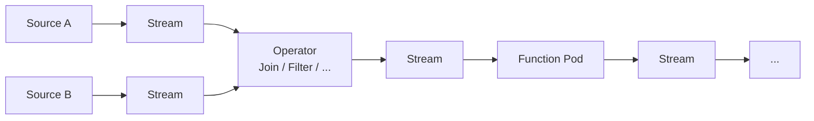
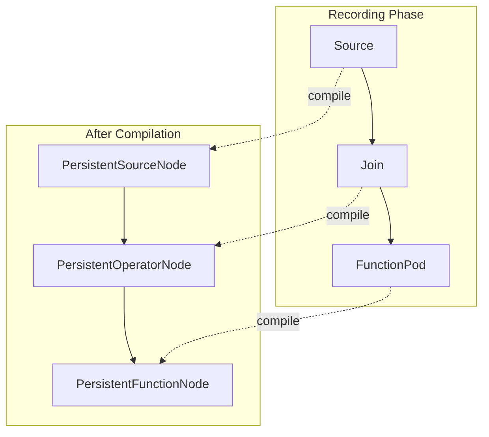

# Architecture Overview

orcapod is built around a small number of composable abstractions that enforce a strict
separation between data transformation and structural manipulation. This page provides a
high-level map of how the pieces fit together.

## Core Data Flow

Every pipeline follows this pattern:

1. **Sources** load external data and annotate it with provenance metadata.
2. **Streams** carry data as immutable (Tag, Packet) pairs.
3. **Operators** reshape streams (join, filter, select, rename, batch) without creating new values.
4. **Function Pods** apply computations to individual packets, producing new values with tracked provenance.

## The Five Core Abstractions

### Datagram

The universal immutable data container. Holds named columns with explicit types and supports
lazy conversion between Python dict and Apache Arrow representations. Comes in two forms:

- **Tag** — metadata columns for routing, filtering, and joining. Carries hidden system tags
  for provenance.
- **Packet** — data payload columns. Carries source-info provenance tokens per column.

### Stream

An immutable sequence of (Tag, Packet) pairs over a shared schema. The fundamental data-flow
abstraction — every source emits one, every operator consumes and produces them.

### Source

Produces a stream from external data with no upstream dependencies. Establishes provenance
by annotating each row with source identity and record identity.

### Function Pod

Wraps a stateless **packet function** that transforms individual packets. Never inspects tags.
Used when the computation synthesizes new values.

### Operator

A structural transformer that reshapes streams without synthesizing new packet values. Every
output value is traceable to a concrete input value. Used for joins, filters, projections,
renames, and batching.

## The Operator / Function Pod Boundary

This is orcapod's most important architectural constraint:

| | Operator | Function Pod |
|---|---|---|
| Inspects packet content | Never | Yes |
| Inspects / uses tags | Yes | No |
| Can rename columns | Yes | No |
| Synthesizes new values | No | Yes |
| Stream arity | Configurable | Single in, single out |
| Cached by content hash | No | Yes |

This strict separation keeps provenance clean. Operators are provenance-transparent (no new
values, no provenance footprint). Function pods are provenance-tracked (new values always
carry source-info pointing back to the function).

## Two Parallel Identity Chains

Every pipeline element maintains two hashes:

1. **`content_hash()`** — data-inclusive. Changes when data changes. Used for deduplication
   and memoization.
2. **`pipeline_hash()`** — schema and topology only. Ignores data content. Used for database
   path scoping so different sources with identical schemas share tables.

See [Identity & Hashing](identity.md) for the full specification.

## Execution Models

orcapod supports multiple execution strategies that produce identical results:

| Model | Mechanism | Use Case |
|-------|-----------|----------|
| Lazy in-memory | `FunctionPod` → `FunctionPodStream` | Exploration, one-off computations |
| Static with recomputation | `StaticOutputPod` → `DynamicPodStream` | Operator output with staleness detection |
| DB-backed incremental | `FunctionNode` / `OperatorNode` | Production pipelines with caching |
| Async push-based | `async_execute()` with channels | Pipeline-level parallelism |

See [Execution Models](../user-guide/execution.md) for details.

## Pipeline Compilation

The `Pipeline` class automatically captures computation graphs and upgrades all nodes
to their persistent variants:

See [Pipelines](../user-guide/pipelines.md) for the full pipeline lifecycle.
