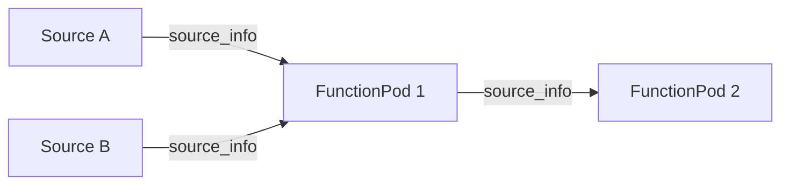

# System Tags & Provenance

orcapod provides two complementary provenance mechanisms: **source info** for tracking
value-level lineage, and **system tags** for tracking row-level lineage through structural
operations.

## Source Info

Every packet column carries a **source info** string — a provenance pointer to the source
and record that produced the value:

```
{source_id}::{record_id}::{column_name}
```

For example:

```
customers_2024::row_42::age
```

Source info is:

- **Set once** — when a source creates the data.
- **Immutable** — preserved through all downstream operations, including column renames.
- **Column-level** — each column independently tracks its origin.

## System Tags

System tags are **framework-managed, hidden provenance columns** automatically attached to
every row. They maintain perfect traceability from any result back to its original source
rows.

### How System Tags Are Created

Each source automatically adds a pair of system tag columns:

```
_tag::source_id::{schema_hash}    → the source's canonical source_id
_tag::record_id::{schema_hash}    → the row identifier within that source
```

For example, a source with schema hash `schema1`:

```
_tag::source_id::schema1 = "customers_2024"
_tag::record_id::schema1 = "row_42"
```

### Three Evolution Rules

System tags evolve differently depending on the operation:

#### 1. Name-Preserving (~90% of operations)

Single-stream operations: filter, select, rename, batch, map.

System tag column names and values pass through **unchanged**. The operation doesn't affect
provenance tracking.

#### 2. Name-Extending (multi-input operations)

Joins and merges. Each input's system tag column name is extended with the node's pipeline
hash and canonical position:

```
Before join:
  Stream A: _tag::source_id::schema1
  Stream B: _tag::source_id::schema1

After join (pipeline_hash=abc123):
  _tag::source_id::schema1::abc123:0    (from Stream A)
  _tag::source_id::schema1::abc123:1    (from Stream B)
```

For commutative operations, inputs are sorted by `pipeline_hash` to ensure identical column
names regardless of wiring order.

#### 3. Type-Evolving (aggregation operations)

Batch and grouping operations. Column names are unchanged but types evolve:

```
Before batch: _tag::source_id::schema1  (type: str)
After batch:  _tag::source_id::schema1  (type: list[str])
```

## The Provenance Graph

orcapod's provenance graph is a **bipartite graph of sources and function pods**:



Operators do not appear in the provenance graph because they never synthesize new values.
This means:

- **Operators can be refactored** without invalidating data provenance.
- **Provenance queries are simpler** — trace source info pointers between function pod table
  entries.
- **Provenance is robust** — lineage is told by what generated the data, not how it was routed.

## Inspecting Provenance

Use `ColumnConfig` to include provenance columns in output:

```python
from orcapod.types import ColumnConfig

# Source info columns (value-level provenance)
table = stream.as_table(columns=ColumnConfig(source=True))

# System tag columns (row-level provenance)
table = stream.as_table(columns=ColumnConfig(system_tags=True))

# Everything
table = stream.as_table(columns=ColumnConfig.all())
```

## Schema Prediction

Operators predict output system tag column names at schema time — without performing the
actual computation — by computing `pipeline_hash` values and canonical positions. This is
exposed via:

```python
tag_schema, packet_schema = operator_stream.output_schema(
    columns=ColumnConfig(system_tags=True)
)
```
